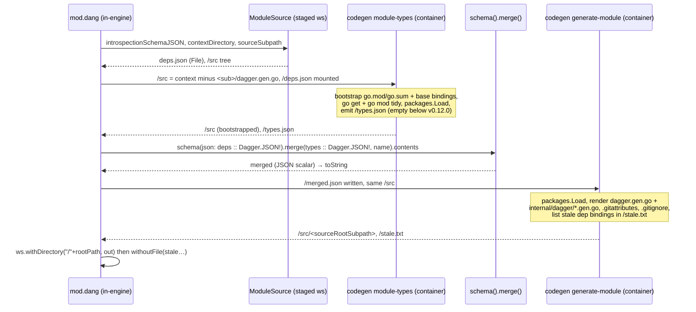

# Go module codegen in go-sdk, and an opt-in build-only runtime

author: yves
created: 2026-08-27
status: done (draft PR dagger/go-sdk#35, CI green at 6ef236e)
related: `design/new-default-template.md`; `github.com/dagger/python-sdk`
`future/done/self-contained-python-sdk.md` (sibling precedent);
`github.com/dagger/java-sdk` `runtime/main.dang` (dang-authored runtime
precedent); the orphaned branch `eunomie/go-sdk@go-sdk-module-codegen-in-repo-bbc41bc2`
(prior attempt, used as a map, not as a base).

## Problem

`dagger generate` for a Go module is still delegated to the engine. `mod.dang`'s
`generate` bottoms out at `ModuleSource.generatedContextDirectory`, which runs
`dagger/dagger`'s native `goSDK.Codegen` (`core/sdk/go_sdk.go`): a container
built from the engine-embedded Go SDK tarball executes `codegen
generate-module` with `experimentalPrivilegedNesting`, because that binary
dials the engine once to merge the module's own types into the schema.

PR #15 already moved *client* codegen into this repository (`helpers/codegen`,
`clientDirectory`, `generateClient` / `generateAllClient`), engine-free. Module
codegen never got the same treatment. That is the one asymmetry PR #15 left,
and it is the reason a Go module's generated code is versioned by the engine
release rather than by this SDK.

There is also no runtime of this SDK's own. A module that wants to run on code
this repository generates has no way to say so; `python-sdk` (`runtime/`) and
`java-sdk` (`runtime/main.dang`) both ship one that a module can reference from
its `dagger-module.toml`.

## Goals

1. `dagger generate` on a `dagger-module.toml` Go module runs this SDK's own
   embedded codegen, engine-free, with the same output shape as the engine's
   native codegen (`dagger.gen.go`, `internal/dagger/*.gen.go`, `go.mod`,
   `go.sum`, `.gitattributes`, `.gitignore`), so the module builds under the
   engine's native Go runtime **and** under this repository's runtime, and so
   a module the engine generated yesterday regenerates here without churn.
2. A small, genuinely optional runtime, authored in Dang, at `runtime/`, that a
   module opts into with `[runtime] source = "github.com/dagger/go-sdk/runtime"`.
   It builds committed generated source; it never generates.
3. Nothing changes for a module that does nothing special. Legacy `dagger.json`
   modules keep being generated and served by the engine's builtin Go SDK.
   `targetRuntime` stays `"go"`.

## Non-goals (YAGNI)

- Flipping `core/sdk/loader.go`'s `case sdkGo`, or touching
  `toolchains/engine-dev/build/sdk.go` / any release-pipeline machinery. The
  engine cutover is a separate workstream.
- Flipping `targetRuntime` to this repository's runtime. Same reason as
  python-sdk's PR 1/PR 2 split: a runtime ref recorded by `dagger module init`
  resolves from `main`, which does not have `runtime/` yet.
- Generating legacy `dagger.json` modules in-repo. The engine regenerates them
  at module load anyway (`useRuntimeCodegen` is true for `dagger.json`), so a
  second generator would only add a second source of truth.
- Forwarding host credentials (GOPRIVATE, gitconfig, SSH agent) into codegen or
  into the new runtime. A Dang module has no host access, so it cannot do what
  `goSDK.moduleDependencyConfigSelectors` does. A module with private Go
  dependencies keeps the engine's codegen through an explicit marker (see
  *Approach §1*).
- The `sdk.debug` terminal in the new runtime; porting `cmd/codegen`'s
  TypeScript generator, `generate-library`, `generate-entrypoint`, the
  `--is-init` scaffolding (`initModule` owns templates here) or `mount.go`
  (dead code).
- Any change to client codegen beyond the one described in *Approach §5*.

## Verified constraints

Verified on `dagger/dagger@v1.0.0-beta.11` (this repository's engine pin).
Where a claim was checked live, the probe is named.

- **The self-type merge is a public core API, and Dang can call it.**
  `core/schema/schematool.go:19-39` installs `Query.schema(json: JSON!):
  Schema`, `Schema.merge(moduleTypes: JSON!, moduleName: String!): Schema` and
  `Schema.contents: JSON!`, view `AfterVersion("v1.0.0-0")`; `core/schematool.go`
  round-trips `__schemaVersion` through `Contents()`. Probe (scratch Dang
  module, engine beta.11): the exact expression
  `schema(json: deps.contents :: Dagger.JSON!).merge(moduleTypes:
  types.contents :: Dagger.JSON!, moduleName: name).contents` type-checks and
  runs; the result is a `JSON` scalar and `toString(merged)` is the text. The
  ascription is required (`String!` is not coerced to `JSON!` on a field
  selection) and the scalar must be spelled `Dagger.JSON`, not `JSON`. So the
  old design doc's option (c) — split the merge out of the codegen binary and
  do it at the Dang layer — is reachable today with no new primitive.
- **The engine's own generator makes exactly one engine call.**
  `cmd/codegen/generator/go/generate_module.go` at beta.11: bootstrap `go.mod`
  → `packages.Load` → `ModuleIntrospectionJSON` → `Dag.Schema(deps).Merge(types,
  name).Contents()` → render → post-commands (`go get dagger.io/dagger@<pin>`,
  `go mod tidy`, `go work use .`). Everything but the merge is `go/packages`,
  `text/template` and `os/exec`. The merge is skipped when the schema version
  is below `v0.12.0` (`:118-172`), where module types are aliased into the
  main package and would collide with the user's declarations.
- **The deps schema is one field away.** `ModuleSource.introspectionSchemaJSON`
  (`core/schema/modulesource.go:257`, impl `:3902`) is
  `loadDependencyModules(src, src)` → `SchemaIntrospectionJSONFileForModule`,
  the same derivation `runSDKCodegen` (`:2605`) hands `goSDK.Codegen`.
  `clientSchemaIntrospectionJSON` is the client-facing one and is the wrong
  input for modules. Probe: a module declaring `engineVersion = "v1.0.0-0"`
  gets `__schemaVersion: "v1.0.0"` (views normalise to the base version), so
  every `dagger-module.toml` module is above the `v0.12.0` merge floor.
- **The module's context is the whole workspace.** Probe:
  `ws.moduleSource("/mods/app").contextDirectory` lists the workspace root
  (`dagger.toml`, `go.work`, sibling dirs); `sourceRootSubpath` is the module
  root and `sourceSubpath` the `source = ...` subdirectory when one is
  declared. The native codegen mounts exactly that at `/src` and runs in
  `/src/<sourceSubpath>` (`core/sdk/go_sdk.go` `baseWithCodegen`), which is
  what makes a parent `go.work`, a `replace ../lib` and a nested `source` work.
- **Generated module code does not import `dagger.io/dagger`.**
  `templates/src/_dagger.gen.go/defs.go.tmpl:26` imports it only under
  `IsStandaloneClient`; module code imports `github.com/dagger/querybuilder`,
  `github.com/Khan/genqlient`, `github.com/vektah/gqlparser/v2`,
  `go.opentelemetry.io/otel/*` and `github.com/dagger/otel-go`. The engine's
  `go get dagger.io/dagger@<goSDKLibVersion>` post-command pins the first
  four transitively before `go mod tidy` prunes the unused require; `otel-go`
  is **not** in `dagger.io/dagger`'s `go.mod` at the pin and floats to
  `@latest` at generation time — under the engine too. The engine pin at
  beta.11 is `1309520660f6a5b35ef97b4fbe151e32a06a8dc5` (`core/sdk/go_sdk.go:27`);
  `dagger.io/dagger`'s `go.mod` there says `go 1.26.1`, and the engine's own
  toolchain constant is `distconsts.GolangVersion = "1.26"` at beta.10 and
  beta.11.
- **The engine decides no-codegen-at-load by config format.**
  `core/sdk/utils.go:23`: `useRuntimeCodegen(src) = ConfigFilename !=
  "dagger-module.toml"`. For a toml module the native runtime takes
  `baseWithoutCodegen` (`core/sdk/go_sdk.go`): require `dagger.gen.go` and
  `internal/dagger/dagger.gen.go`, mount the context at `/src`, workdir
  `/src/<sourceSubpath>`, `go build -ldflags "-s -w" -o /runtime .`, entrypoint
  `/runtime`, workdir `/scratch`, unmount the shared caches. That is the whole
  contract the in-repo output has to satisfy, and the whole job of the opt-in
  runtime.
- **What the engine writes around the generated code.** `runCodegen`
  (`core/schema/modulesource.go:2622-2743`, engine-side, not `cmd/codegen`)
  appends `/<path> linguist-generated` to `<sourceSubpath>/.gitattributes` for
  each of `VCSGeneratedPaths` = `dagger.gen.go`, `internal/dagger/**`,
  `internal/telemetry/**` (`go_sdk.go:283-287`; the third is stale but still
  emitted), and, unless `[codegen] automaticGitignore = false`, appends
  `VCSIgnoredPaths` to `.gitignore` — for toml modules only the entries that do
  not overlap a generated path survive `ignoresGeneratedPath`, which leaves
  `/.env`. Both files are appended to existing contents, skipping an entry
  whose text already occurs anywhere in the file (`bytes.Contains`).
- **`loadPackage` does not look at package errors, and not all of them are
  equal.** `cmd/codegen/generator/go/loader.go` checks only the package count
  and name; `packages.Load` runs `go list -e`, so an import that cannot be
  resolved yields a package whose affected types are `invalid type` and the
  emitter would silently drop or mistype the functions using them. Under the
  engine that import is always resolvable (credentials are forwarded), so the
  gap never shows. But the loader also strips every function body before
  type-checking, so an import used only inside a body reports `imported and
  not used` — a `packages.TypeError` on a perfectly ordinary module (probe:
  reproduced with `fmt`). Unresolvable modules and imports surface as
  `packages.ListError`. An engine-free port must therefore fail on
  `ListError` and `ParseError` and keep tolerating `TypeError`, as the engine
  effectively does. The root package records an unresolvable import only as
  a `TypeError` ("could not import"); the `ListError` naming the missing
  module sits on the imported stub, which `NeedImports` (without `NeedDeps`)
  exposes cheaply.
- **`go work use .` edits a file outside the module.** When `go env GOWORK`
  is non-empty the engine appends `go work use .` (`generate_module.go:340`)
  and its `generatedContextDirectory` diff carries the modified parent
  `go.work` back; a nested module that is not enrolled in its parent
  workspace does not build.
- **A module SDK signals "trust committed files" by signature.**
  `core/sdk/module.go:75` `RuntimeTrustsCommittedFiles`: `moduleRuntime`'s
  `introspectionJson` argument is optional. `core/sdk/module_runtime.go:50-91`
  then omits the argument for toml modules and appends
  `withWorkdir("/scratch")` itself. `codegen(modSource, introspectionJson)` is
  looked up by name too (`core/sdk/consts.go` `sdkFunctions`); java-sdk's
  runtime keeps a no-op one so the code-generator contract is satisfied.
  `moduleTypes` and `withConfig` are optional; without `moduleTypes` the
  engine takes `moduleDefViaRuntime` (`core/schema/modulesource.go:3731-3769`),
  the same path the native Go SDK takes since it dropped `moduleTypes`.
- **Any module ref is a runtime.** `core/sdk/loader.go:89`
  `externalSDKForModule` resolves `[runtime] source` relative to the module
  (`ResolveDepToSource`), so a relative local path is a legal runtime source —
  python-sdk's fixture uses six `..`. `namedSDK` tries the builtin table first
  and only `errUnknownBuiltinSDK` falls through, so `"go"` can never mean this
  repository: keeping `targetRuntime = "go"` keeps the engine builtin.
- **Self-calls under a module SDK.** `goSDK.AlwaysEnablesSelfCalls` returns
  true; a module-backed SDK does not implement it, so
  `ModuleSource.SelfCallsEnabled` (`core/modulesource.go:168`) is driven by
  the module's experimental flag. `Module.IncludeSelfInDeps` is gated on
  `typeDefsEnabled && isSelfCallsEnabled` (`core/schema/modulesource.go:3797`)
  and `typeDefsEnabled` is false for both runtimes (neither implements
  `moduleTypes`), so self bindings behave identically. The only remaining
  effect is `core/module.go:2395`: a module type that shadows a core or
  dependency type name is tolerated by the native runtime and rejected by the
  opt-in one. Known, narrow divergence; the experimental flag is the escape
  hatch.
- **CI drives a released CLI binary against the current engine.**
  `dagger.toml` installs `github.com/dagger/sdk-sdk` (locked at `3344489`),
  whose black-box checks vendor this working tree, `dagger sdk install` it,
  `dagger module init` a module (toml, `[runtime] source = "go"`), `dagger
  generate`, then `dagger api functions` — through CLI `1.0.0-beta.10`
  (`sdk-sdk.dang:40`). Every harness command runs with
  `experimentalPrivilegedNesting: true` (`sdk-target.dang:559`), so the nested
  CLI dials the **outer** engine, i.e. CI's; `mod.dang` already calls
  `Workspace.withDirectory`, which does not exist at beta.10, and `main` is
  green. So `sdk-sdk:module:loads` proves that in-repo codegen output builds
  under the engine's native `baseWithoutCodegen`, and `sdk-sdk:chain:*` prove
  dependency bindings resolve — at the engine CI runs, not at beta.10.
- **Shared generator drift.** `helpers/codegen` was extracted before engine
  beta.10 introduced nullable-object returns (`go: return nullable objects`,
  dagger/dagger `41472c623c`; `generator.SupportsNullableObjects`,
  `IsNullableObject`, `_types/object.go.tmpl`, `dag/dag.gen.go.tmpl`). A
  module generated by the engine at beta.10+ has `(*T, error)` signatures for
  optional-object fields; generating it here without that change would
  silently rewrite a user's bindings. The module template set at beta.11
  (`modules.go`, `module_*.go`, `introspect_emit.go`, `visit.go`,
  `optional.go`) differs from the orphaned branch's port only by the
  `+agent` pragma and helpers the client extraction already removed.
  `moduleMainSrc` (the `invoke` dispatcher) walks the package scope; the only
  schema lookups on that path (`visit.go`, `module_enums.go`) resolve core and
  dependency enums, which the *deps* schema already carries, so the dispatcher
  does not depend on the merged half.

## Proposed approach

Two additions and one split, all inside this repository.

### 1. `Mod.generate` splits on config format

Mirrors `python-sdk`'s `mod.dang` exactly:

```
generate(ws) =
  skip marker             -> empty changeset
  engine-codegen marker   -> engine generatedContextDirectory
  dagger-module.toml      -> in-repo codegen (this design)
  dagger.json             -> engine generatedContextDirectory (unchanged)
```

`isModern` is "`<rootPath>/dagger-module.toml` exists", read from the
workspace. The local-dependency staging (`generateLocalDependencies`) stays in
front of every branch so dependency bindings are fresh.

`Mod.generate` is `Mod.generated(ws).changes(ws)`: `generated` returns the
workspace with the module's output staged onto it, and `GoSdk.generate` folds
every managed module through it (`reduce(ws) { staged, mod =>
mod.generated(staged) }`) before taking one changeset at the end. Modules
share files — two modules under one `go.work` each run `go work use .` on it —
and mapping them all against the same baseline would produce changesets whose
edits to that file conflict, so only the last merged one would survive.

The engine-codegen marker, `.dagger-go-sdk-engine-codegen`, found at or above
the module root exactly like the skip marker (so a directory carrying it
covers every module beneath it), is the escape hatch for what an engine-free
generator cannot do: a module with private Go dependencies needs
the host credentials only the engine's native codegen injects. The engine
path is what every toml module runs today, so the marker changes nothing for
the module except who generates it.

### 2. Two engine-free passes around one in-engine merge



- **Inputs.** `let src = stagedWs.moduleSource("/" + rootPath)`. The container
  mounts `src.contextDirectory` — with `<sourceSubpath>/dagger.gen.go`
  removed, as `baseWithCodegen` does, since the stale dispatcher would not
  compile against a changed schema — at `/src`, and
  `src.introspectionSchemaJSON` at `/deps.json` (a `File`, no string
  round-trip). Both passes get `--output /src --module-source-path
  <sourceSubpath> --module-parent-path <sourceSubpath → /src>` (the engine's
  `relativeTo(modulePath, outputDir)`, which feeds the `@sourceMap` comments
  on every generated type), so `go env GOWORK`, a `replace ../lib`, a nested
  `source` and the source-map links resolve exactly as under the engine.
- **Pass A — `codegen module-types`.** Bootstraps the module to a loadable
  state as the engine does (`go.mod` for a fresh module, a base `dagger.gen.go`
  + `internal/dagger/dagger.gen.go` from the deps schema, the post-commands,
  looping while `NeedRegenerate`), loads the package with `go/packages`
  (function bodies stripped), and writes the module's own types as
  introspection JSON to `/types.json`. Below schema version `v0.12.0` it
  writes an empty file and the merge is skipped, as the engine does. The
  "dependency installed under the module's own name" guard moves here, since
  the merge is keyed on that name.
- **Merge — Dang.** `schema(json: deps.contents :: Dagger.JSON!).merge(moduleTypes:
  types.contents :: Dagger.JSON!, moduleName: src.moduleOriginalName).contents`,
  then `toString`. One reference implementation, the engine's, shared with
  every other SDK. The schema text crosses the Dang boundary as call
  arguments (into the call ID and telemetry) — the same shape `clientDirectory`
  already uses for `clientSchemaIntrospectionJSON`, at the same size.
- **Pass B — `codegen generate-module`.** Takes the merged schema, loads the
  package again (the `invoke` dispatcher is AST-derived), renders every
  binding file, writes `.gitattributes` and `.gitignore` at the source subpath
  the way `runCodegen` does (three `linguist-generated` lines; `/.env` unless
  `[codegen] automaticGitignore = false` in `dagger-module.toml`, decoded with
  `github.com/pelletier/go-toml`, the library `core/modules` uses; both
  appended to existing contents with the engine's substring de-duplication),
  and
  lists per-dependency bindings that exist on disk but were not regenerated
  (`findStaleDependencyBindings`, dagger/dagger `ec82c2c212`) in `/stale.txt`,
  as paths relative to `/src`.
- **Dang applies.** `ws.withDirectory("/" + rootPath, moduleRoot)` — where
  `moduleRoot` is `out.directory(src.sourceRootSubpath)`, or `out` itself when
  the subpath is empty (a module at the workspace root) — layers the generated
  module root onto the workspace: a merge, never a replace, so a file the
  workspace view might not carry can never be reported as removed. Then
  `withoutFile` drops each stale binding, re-rooted from `/src` to the
  workspace. The helper also records the `go.work` in effect (`go env GOWORK`,
  relative to `/src`, empty when none) in `/gowork.txt`; when there is one,
  `go work use .` may have enrolled the module, and Dang carries that file
  (and its `.sum`, when present) back with `withNewFile` — but only when the
  file lies inside the caller's cwd cone, because `changes(ws)` refuses paths
  outside it. "Changed" covers the `.sum` too: `go work use` and `go work edit
  -replace` rewrite `go.work`, while `go mod tidy` under a workspace can touch
  only `go.work.sum`. When the file lies outside the cone and either changed,
  `generate` raises an actionable error — *generating `<module>` changed
  `<go.work>`, which is outside the current directory: run `dagger generate`
  from the workspace root* — rather than silently dropping the edit. It names
  the file that changed rather than the enrolment, since the `replace` copy is
  a second reason it changes. The engine-delegated branches keep today's behaviour
  (`.directory(rootPath)` scoping, no `go.work` propagation); the asymmetry is
  deliberate — those branches are unchanged by design. `changes(ws)` reports
  only the difference, rooted at the caller's cwd.

Both passes run in containers derived from one `codegenBuilder` (the binary
is built once and content-addressed) and mount the same `go-mod` / `go-build`
cache volumes, so the second `packages.Load` re-type-checks only the user's own
package against cached export data. The binary keeps PR #15's property: no
`dagger.io/dagger` import, no `dagger.Connect`, no nested session.

### 3. `go.mod` and the `dagger.io/dagger` pin

`bootstrapMod` and `syncModReplaceAndTidy` are the engine's, minus the
`--is-init` name check and with one substitution: the engine reads the SDK
library's `go.mod` from an embed (`dagger.GoMod`); here the helper fetches the
same file with `go list -m -json dagger.io/dagger@<goSDKLibVersion>` (only
the `.info` and `.mod` entries are fetched, from the module proxy, cached in
the shared `go-mod` volume) and parses the `GoMod` path it reports. Everything downstream is verbatim: seed
minimum versions from the library's `require` block, copy the library's
`replace` directives (four `go.opentelemetry.io/otel/{log,sdk/log,exporters/…}`
pins) into a module that already requires those paths with `go mod edit
-replace` and, under a `go.work`, `go work edit -replace`, then `go get
dagger.io/dagger@<pin>` unless `go.mod` already replaces `dagger.io/dagger`,
`go mod tidy`, and `go work use .` when `go env GOWORK` is non-empty. The
engine's `go.sum` seeding from the embed is the one thing not reproduced;
`go mod tidy` fills `go.sum` from the checksum database as it does for every
other module.

- Fresh module: `module dagger/<kebab-name>`, `go <major.minor of the
  toolchain>`. The engine writes its codegen binary's full patch version;
  writing `1.26` and letting `go get dagger.io/dagger@<pin>` raise it to the
  pinned library's own directive produces `go 1.26.1` (probe: confirmed) and
  keeps the builder image's patch level out of users' `go.mod`. The builder is
  `golang:1.26-alpine`, matching `distconsts.GolangVersion`; if the engine
  moves its toolchain, `codegenBuilder` and `goSDKLibVersion` move together.
- Existing module: parsed with `modfile.ParseLax`, rejected if its `go`
  directive is newer than the toolchain.
- Every post-command failure is fatal, as under the engine. So is a
  `packages.ListError` or `packages.ParseError` on the module package (an
  unresolvable module or import, a file that does not parse); a
  `packages.TypeError` is tolerated, as the engine does, because body
  stripping makes unused-import errors routine. Tolerating a post-command
  failure would leave a partially rewritten `go.mod` (`go get` writes before
  `go mod tidy` fails); tolerating a `ListError` would emit silently
  truncated bindings. The engine-codegen marker is the supported answer for
  the one case that needs credentials. `go list -m -json` runs from a scratch
  directory, outside the module, with `GOFLAGS` and `GOWORK` cleared in its
  environment, so `dagger.io/dagger@<pin>` is resolved on its own rather than
  against the module's own graph, an enclosing workspace or an inherited
  `-mod=vendor`.

`goSDKLibVersion` is a Dang constant in `go-sdk.dang`, the analogue of the
engine's, initialised to the engine's beta.11 value for parity. Bumping it is
a one-line change here rather than an engine release.

`codegenBuilder` moves from `golang:1.25-alpine` to `golang:1.26-alpine`
(already locked in `dagger.lock`) because the pinned library needs Go ≥
1.26.1, and gains `git` + `openssh` so `go mod tidy` can fall back to VCS.
`helperTestsCheck` moves to the same image in the first code patch;
`helpers/codegen/go.mod` stays at `go 1.25.1` (none of the new dependencies
needs more).

### 4. `runtime/` — the opt-in build-only runtime

A second Dang module, `go-sdk-runtime` (`runtime/dagger-module.toml`,
`[runtime] source = "dang"`, `engineVersion = "v1.0.0-0"`), the shape of
`java-sdk`'s:

```
type GoSdkRuntime {
  codegen(modSource: ModuleSource!, introspectionJson: File): GeneratedCode!
    # no-op: generatedCode(code: modSource.contextDirectory)
  moduleRuntime(modSource: ModuleSource!, introspectionJson: File): Container!
    # require <sub>/dagger.gen.go + <sub>/internal/dagger/dagger.gen.go, else raise
    #   "run `dagger generate` and commit the generated files"
    # golang:1.26-alpine + git (go build falls back to VCS when the proxy
    #   cannot serve a dependency); go-mod + go-build cache volumes, sharing SHARED
    # /src <- contextDirectory (mounted), workdir /src/<sourceSubpath>
    # go build -ldflags "-s -w" -o /runtime .
    # withoutMount both caches, withEntrypoint ["/runtime"]
}
```

`introspectionJson` is declared optional and never read: its optionality is
what `RuntimeTrustsCommittedFiles` reads. The engine appends
`withWorkdir("/scratch")` itself. A `dagger.json` module that names this
runtime explicitly is handed introspection JSON, ignores it, and fails the
generated-files check unless it committed them — a supported-configuration
statement, the same one python-sdk makes.

Why a separate module rather than `moduleRuntime` on `GoSdk`: the root module
is the *authoring* SDK (`initModule`, `initClient`, `generateClient`,
`targetRuntime`, all with workspace-style signatures). Loading it as a
module-backed runtime SDK would advertise those as module-SDK capabilities
with the wrong signatures. Both siblings keep authoring and runtime apart, and
the engine's own `go-sdk` install-name mapping is an authoring registry
(python-sdk's doc, verified there), not a loading hook.

A module opts in with `[runtime] source = "github.com/dagger/go-sdk/runtime"`
(or a local path). `targetRuntime` stays `"go"`.

### 5. Nullable-object returns in the shared generator

Before porting the module templates, the shared files pick up beta.11's
nullable-object support (`generator/functions.go`, `templates/functions.go`,
`_types/object.go.tmpl`, `dag/dag.gen.go.tmpl`, `nullable_object_test.go`) and
`GeneratedState.{RemovePaths, PostCommands, NeedRegenerate}` + `Apply`.

This is a behaviour change, not housekeeping: `generateClient` output changes
for schema fields that return optional objects on engines ≥ beta.10 (`*T` →
`(*T, error)`, returning `nil, nil` on null), to what the engine's own client
generator already emits. It is load-bearing for Goal 1 (module bindings must
not flip signatures between an engine-generated and an in-repo-generated
run), so it cannot be isolated to module mode without making the two paths
disagree. It lands as its own patch, first in the series, and is called out
in the PR description. Nothing in this repository commits a generated client,
so CI is unaffected. The `Binding`/`Env` entries PR #15 added to
`introspection/filters.go` stay.

The second client-visible change is the `go` directive of a *fresh* client's
`go.mod`. It was `runtime.Version()`, the codegen builder's full patch
version; with the builder on Go 1.26 for module generation that would pin new
clients to `1.26.7`. It becomes the toolchain's language version (`1.26`), as
module generation already writes, and the `dagger.io/dagger` requirement
raises it to whatever the library needs. An existing client's `go.mod` keeps
its own directive, unchanged.

## Alternatives considered

- **(a) Nested engine in the codegen container** — keep `Dag.Schema().Merge()`
  inside the binary with `experimentalPrivilegedNesting`. Faithful to
  `go_sdk.go`, but reintroduces the engine dependency PR #15 removed, and it is
  unnecessary now that the merge is reachable from Dang. Rejected; it stays
  the documented fallback should the schema-as-argument round trip ever prove
  too heavy.
- **(b) Reimplement the merge in Go** — duplicates `core/schema` merge
  semantics that the engine centralised so every SDK shares them. Rejected.
- **Generate `dagger.json` modules in-repo too** (what the orphaned branch did).
  The engine regenerates them at load regardless, `sdk.source: "go"` cannot
  be pointed at this SDK's runtime, and it would change behaviour for every
  existing module. Rejected; python-sdk made the same call.
- **`moduleRuntime` on the root `GoSdk` type.** See §4.
- **Mount only the module directory** instead of the context. Simpler input,
  but a parent `go.work`, a `replace ../lib` and a nested `source` all break.
  Rejected in favour of the engine's own layout.
- **Replace the module directory (`withNewDirectory`) to propagate stale
  binding removals.** Simpler, but a file missing from the workspace view would
  be reported as deleted. The explicit `withoutFile` list is safer.
- **Tolerating `go mod tidy` failures for private dependencies.** `go mod
  tidy -e` drops the unreachable `require` (probe); a warn-and-continue rule
  leaves `go.mod` half-rewritten and, because `loadPackage` ignores package
  errors, emits bindings with the affected functions silently missing.
  Rejected; the engine-codegen marker keeps such modules on the path that has
  credentials.
- **Single `packages.Load` across both passes** (the orphaned plan's
  aspiration). Feasible — the dispatcher needs the AST and only core or
  dependency enums from the schema, so `dagger.gen.go` could be rendered in
  pass A — but it needs a per-pass render
  set through `generateCode`, and the second load is cheap with warm caches.
  Not worth the entanglement now; a later optimisation.
- **A committed, pre-generated runtime fixture** (python-sdk's choice).
  ~18k lines of bindings that go stale silently. The checks here generate the
  fixture on the fly with the code under test and hand the staged workspace
  to the harness, so the fixture commits only `main.go` and its config.

## Affected components

- `helpers/codegen/**` — nullable-object returns; re-widened internals;
  `loader.go`, `generate_module.go`, `dependency_files.go`, `vcsfiles.go`
  (`.gitattributes`/`.gitignore`), `templates/{modules,module_*,
  introspect_emit,visit,optional}.go`, module `.tmpl` files, tests;
  `main.go` gains `module-types` and `generate-module` modes and the
  `--module-root-path` flag (the module root is passed in rather than found
  by walking up from the source dir, which would let an ancestor module's
  `dagger-module.toml` decide `automaticGitignore` for a nested one);
  `go.mod` adds
  `github.com/dave/jennifer`, `github.com/mitchellh/mapstructure` (both
  already used by `cmd/codegen`) and `github.com/pelletier/go-toml` (used by
  `core/modules`). `cmd/codegen`'s `go-layerfs` is not needed: the overlay
  has a single layer.
- `mod.dang` — `isModern`, the engine-codegen marker, `generated` /
  `generatedWorkspace`, stale-binding and `go.work` propagation.
- `go-sdk.dang` — `engineCodegenFilename` next to `skipGenerateFilename`,
  `codegenBuilder` (go 1.26, git), `goSDKLibVersion`.
- `runtime/dagger-module.toml`, `runtime/main.dang` (new).
- `dagger.toml` — new managed fixtures, and `[modules.go-sdk-runtime]` so the
  runtime is a workspace module CI loads and validates.
- `.dagger/modules/e2e/dagger.json` — `sdk-sdk` dependency (pinned like
  python-sdk's e2e) for checks through a released CLI.
- `.dagger/modules/e2e/main.dang` (+ `helperTestsCheck` image), new fixtures
  under `.dagger/modules/e2e/fixtures/` — see *Testing*.
- `design/go-module-codegen-and-runtime.md` (this doc).

## Testing

**Helper unit tests** (`e-2-e:helper-tests-check` already runs `go test ./...`):
the ported `introspect_emit_test.go`, `modules_test.go`,
`module_interfaces_test.go`, `module_objects_test.go`,
`visit_determinism_test.go`, `interface_surface_test.go`,
`nullable_object_test.go`, `dependency_files_test.go`, `generate_module_test.go`,
plus `main_test.go` cases for the new modes' required flags, a `loader_test.go`
that loads a tiny package, tolerates an import used only inside a function
body, and fails on an unresolvable import, the
engine's `syncModReplaceAndTidy` test against a fake library `go.mod` (replace
copy, `go work` edits), and tests for the `.gitattributes`/`.gitignore`
append with substring de-duplication and the `automaticGitignore` decode.

**e2e (Dang checks, in-process):**

- `generateTomlModuleCheck` — `fixtures/toml-generate/app` (toml, `[runtime]
  source = "go"`, a `Greeting` function): asserts `dagger.gen.go`,
  `internal/dagger/dagger.gen.go`,
  `internal/dagger/toml-generate-app.gen.go` (the self bindings — proves the
  merge happened), `go.mod`, `go.sum`, `.gitattributes` (three lines) and
  `.gitignore` (`/.env`) are added, `go.mod` carries no absolute-path replace
  (`=> /`, which would pin a dependency to a path off the build host), its
  `go` directive is the pinned library's `go 1.26.1`, and `main.go` is not
  modified.
- `generateIsIdempotentCheck` — generating `fixtures/toml-generate/app`,
  staging the result and generating again from the staged workspace yields an
  empty changeset: no added, modified or removed path.
- `generateNestedSourceCheck` — `fixtures/toml-nested/app` with `source =
  "src"`: generated files, `.gitattributes` and `.gitignore` all land under
  `src/`.
- `generateRemovesStaleBindingCheck` — `fixtures/toml-stale/app` commits an
  orphaned `internal/dagger/old-dep.gen.go` carrying the generated header:
  it must appear in `changes.removedPaths`; a hand-written
  `internal/dagger/keep.gen.go` without the header must not.
- `generateEnrollsGoWorkCheck` — a synthetic workspace (`Directory.asWorkspace`,
  as `modulesCwdCheck` already does) holding `dagger.toml`, a `go.work` that
  lists nothing but the toolchain line (so it is consistent with whatever the
  view carries), and the toml fixture: generated from the root, `go.work`
  lists the module afterwards; generated with `cwd` at the module, the
  actionable error is raised.
- `generateEnrollsEveryModuleInGoWorkCheck` — the same synthetic workspace
  with *both* toml fixtures and a `dagger.toml` registering just those two:
  one `goSdk.generate` must leave `go.work` listing both. It is the
  regression test for the sequential staging in §1; merging independent
  changesets loses one of the two `use` lines.
- `generateEngineCodegenMarkerCheck` — `fixtures/engine-codegen/app` carries
  the marker; generation still adds `dagger.gen.go` (the engine path), and
  `mod.engineCodegen(ws)` reports true.
- `moduleCompilesCheck` — `go build ./...` the generated module in a plain
  `golang:1.26-alpine` container, no engine, no mounted SDK. The portability
  proof.
- `generateModuleCheck` / `generateCheck` — unchanged assertions on the legacy
  fixture, proving the `dagger.json` path still goes through the engine.
- `modulesCheck` / `modulesCwdCheck` — the new managed fixtures are listed.

**e2e (through a released CLI, via the sdk-sdk harness, as python-sdk does):**
the view handed to the harness is `ws.withChanges(changes).directory("/")` —
the full staged workspace — never `Changeset.after`, which holds only the
touched subtree (probe).

- `nativeRuntimeCallCheck` — generate `toml-generate/app` in-process, `dagger
  call -m <fixture> greeting` with `[runtime] source = "go"`: the engine's
  native `baseWithoutCodegen` builds and runs in-repo output.
- `runtimeCallCheck` — same for `fixtures/runtime/app`, whose runtime is
  `../../../../../../runtime`: this repository's runtime builds and runs it.
- `runtimeRequiresGeneratedFilesCheck` — the runtime fixture with
  `dagger.gen.go` removed must fail with "run `dagger generate` and commit".

Each harness check pays the scaffold pipeline (`sdk install`, `module init`,
`generate`) before its own command and reports a prerequisite failure as
`skipped`; budget minutes, not seconds.

**Already in CI:** `sdk-sdk:generation:*`, `sdk-sdk:module:loads`,
`sdk-sdk:chain:*` now exercise the in-repo codegen on scaffolded toml modules
end to end, including local-path dependency bindings.

## Risks

- **`go get` needs the network inside codegen.** Same as the engine today
  (its container has the module cache pre-warmed, ours has the shared cache
  volume). A proxy outage fails generation loudly, as it does under the
  engine.
- **Private dependencies need the marker.** Without
  `.dagger-go-sdk-engine-codegen`, a module importing a private Go module
  fails `dagger generate` with the toolchain's error (§3); nothing is written.
  The marker is documented next to the skip marker.
- **Pin drift.** `goSDKLibVersion` here and the engine's can diverge; a module
  generated here and later regenerated by the engine (or vice versa) gets a
  `go.mod` churn of transitive versions; `otel-go` floats under both. The
  `go list -m` of the pinned library is one more network round trip per
  fresh cache. Three
  pins now describe "which Dagger" (`dagger.json` `engineVersion`, e2e's
  `daggerSourceRef`, `goSDKLibVersion`); an engine bump should move all three.
- **Shared-generator drift.** `helpers/codegen` is a copy; beta.12 changes to
  `cmd/codegen/generator/go` do not arrive by themselves. The divergence is
  the point (release cadence), but the client extraction already carries this
  risk and this doubles the surface.
- **Cold caches in the opt-in runtime.** The engine's native runtime pre-seeds
  `/go/pkg/mod` and `/root/.cache/go-build` from its tarball and forwards
  host `GOPROXY`/`GODEBUG` through internal APIs a Dang module cannot call;
  the opt-in runtime's first build in a fresh environment downloads
  everything.
- **Harness cost.** Three checks spin a nested engine through CLI beta.10.
- **Self-calls tolerance divergence** under the opt-in runtime (see
  *Verified constraints*); no regression test, documented instead.
- **Unpinned runtime ref.** A module opting in by `github.com/dagger/go-sdk/runtime`
  with no version floats on this repository's default branch; the workspace
  `dagger.lock` entry is the mitigation. Same exposure as java-sdk.

## Implementation plan

Stacked Git series on this branch, each patch signed off, keeping `go build`,
`go vet` and `go test ./...` green in `helpers/codegen` after every patch, and
the existing `codegen --introspection-json-path … --output …` invocation (no
subcommand) working until `go-sdk.dang` moves off it.

1. `design: Go module codegen in go-sdk and an opt-in runtime` — this doc.
2. `codegen: return nullable objects like engine beta.11` — nullable-object
   returns, `GeneratedState` fields, `Apply`; `nullable_object_test.go`;
   `helperTestsCheck` on `golang:1.26-alpine`.
3. `codegen: re-widen generator internals for module generation` —
   `templates/functions.go` (`ctx`, `modulePkg`, `moduleFset`, `pass`,
   `GoTemplateFuncsForModule`, the `IsPartial` FuncMap entry), `generator.go`
   (`moduleGenCtx`, `templateFuncs`, `internalDaggerDir`,
   `PackageInfo.DaggerPkgReplaced`, dependency files under
   `internal/dagger` in module mode), `config.go` (`LibVersion`). Client path
   passes `nil` and is unchanged.
4. `codegen: port the go/packages module loader` — `loader.go` (trace span
   dropped), `loader_test.go`.
5. `codegen: port the Go module template set` — `templates/{modules,module_types,
   module_enums,module_objects,module_interfaces,module_funcs,introspect_emit,
   visit,optional}.go`, `src/_dagger.gen.go/module.go.tmpl`,
   `src/internal/dagger/dagger.gen.go.tmpl`, `src/dagger.gen.go.tmpl`
   (`IsModuleCode` branch), the `ModuleMainSrc` FuncMap entry and
   `ModuleIntrospectionEmitter` (they need the ported files to compile),
   their tests; deps `jennifer`, `mapstructure`.
6. `codegen: add engine-free module generation` — `generate_module.go`
   (`bootstrapModule`, `bootstrapMod`, `syncModReplaceAndTidy` fed by `go list
   -m -json`, fatal package errors, `GenerateModuleTypes` with the `v0.12.0`
   floor, `GenerateModule`), `dependency_files.go`, `vcsfiles.go`, tests; dep
   `go-toml`.
7. `codegen: add module-types and generate-module modes` — `main.go`
   subcommand dispatch with the flag-only client invocation kept as the
   default, `--module-parent-path`, `--module-root-path`, `applyState`
   post-commands, `/stale.txt`, `main_test.go`.
8. `codegen: write the language version into fresh client go.mod` — the
   `go` directive of a fresh client's `go.mod` (§5).
9. `go-sdk: generate dagger-module.toml modules with the in-repo codegen` —
   `mod.dang`, `go-sdk.dang`, `dagger.toml`, `fixtures/toml-generate/app`,
   `fixtures/toml-nested/app`, `fixtures/toml-stale/app`,
   `fixtures/engine-codegen/app`, e2e `generateTomlModuleCheck`,
   `generateNestedSourceCheck`, `generateRemovesStaleBindingCheck`,
   `generateIsIdempotentCheck`, `generateEnrollsGoWorkCheck`,
   `generateEnrollsEveryModuleInGoWorkCheck`,
   `generateEngineCodegenMarkerCheck`, `moduleCompilesCheck`, count updates.
10. `e2e: run in-repo generated modules through a released CLI` — `sdk-sdk`
   dependency in the e2e module, `nativeRuntimeCallCheck`.
11. `runtime: add the opt-in build-only Go module runtime` — `runtime/`,
    `fixtures/runtime/app`, `runtimeCallCheck`,
    `runtimeRequiresGeneratedFilesCheck`, `dagger.toml`.
12. (after CI green) `design: archive the module codegen and runtime doc` —
    `git mv` to `design/done/`.

## Progress

| item | value |
|---|---|
| phase | done — archived after CI went green on the draft PR |
| branch | `go-sdk-module-codegen-runtime-lead-640790c0` (fork `eunomie/go-sdk`) |
| base | `main` @ `ec2d1ff` |
| PR | https://github.com/dagger/go-sdk/pull/35 (draft) |
| last green SHA | `6ef236e9f823d37e25818ac7fb6dd77dcc102247` (65/65 Dagger Cloud checks) |
